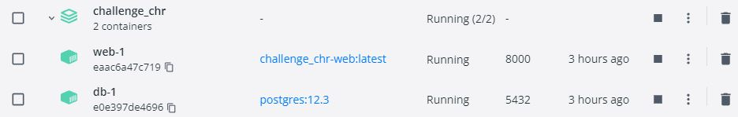
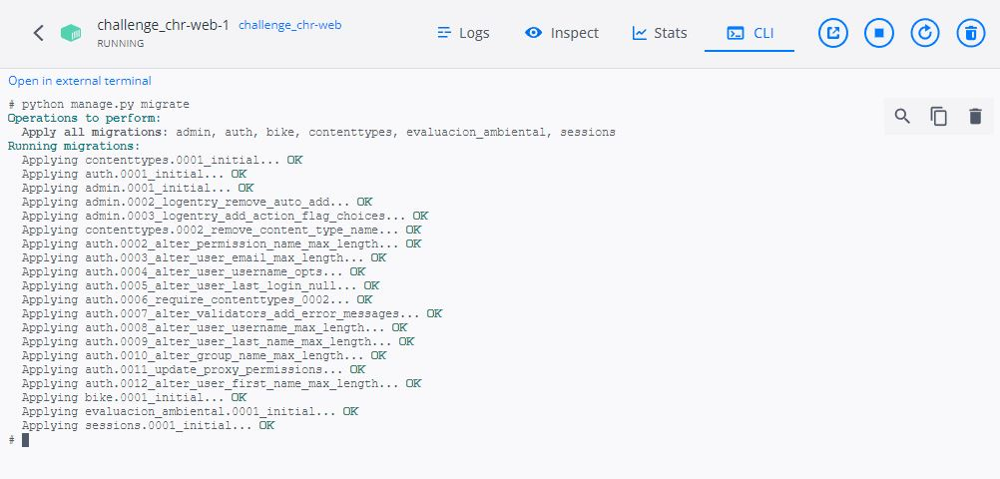
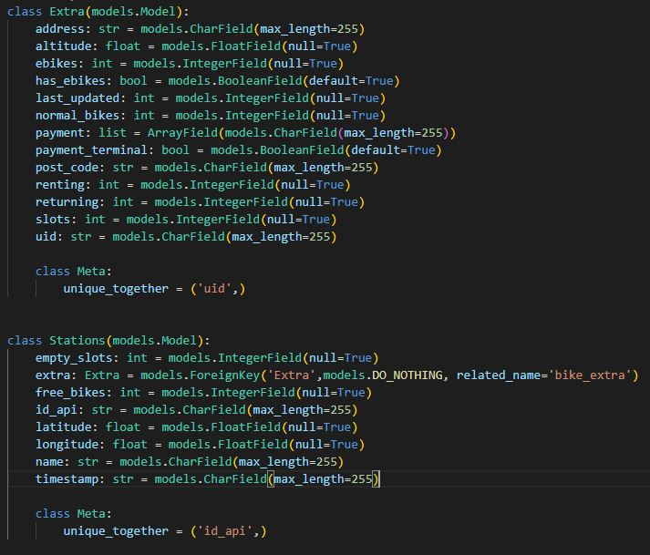
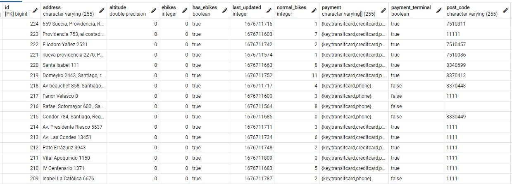
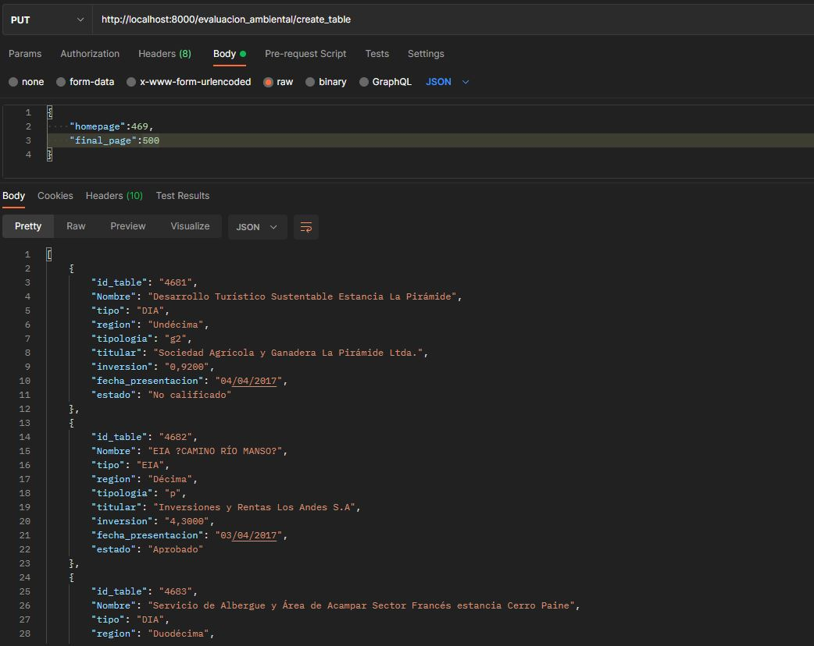
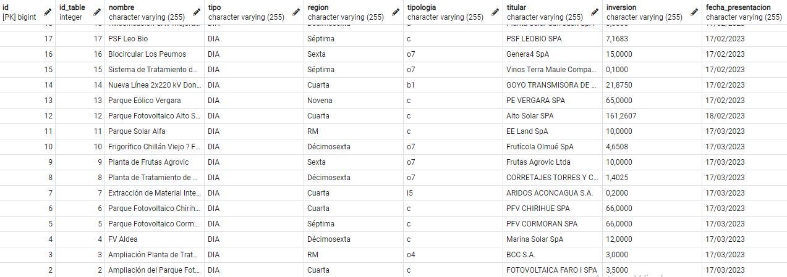
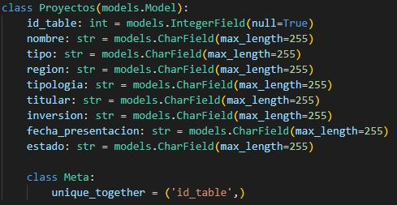
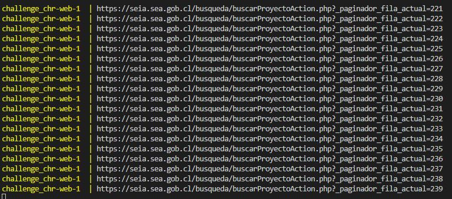
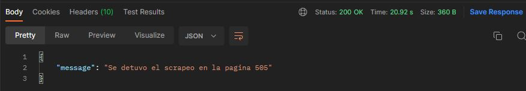

# Challenge_CHR
## Pre-requisitos:
* Docker
* Docker-desktop
* git
* PgAdmi (Recomendable)
* Postman(Recomendable)

Las credenciales para conexion con la base de datos es :

```
NAME : postgres,
USER : postgres,
PASSWORD : postgres,
HOST : localhost,
PORT : 5432
```


## Instalacion:

Seguir los siguientes pasos:

1. Construimos los contenedores.

```
docker-compose build
```

2. Activamos el servicio con:

```
docker-compose up
```
<br>
<p align="center"></p>
<br/>

3. Aplicamos las migraciones, en el CLI del servicio del contenedor.

```
python manage.py migrate
```

<br>
<p align="center"></p>
<br/>

tambien se puede aplicar este comando desde la terminal:

```
docker-compose run web python manage.py migrate
```

## Solucion:

Para la actividades del reto se construyo dos endpoint:

### Actividad 1:
* Metodo : PUT
* URL : http://localhost:8000/bike/create_table

<br>
<p align="center"></p>
<br/>

El endpoint construido se encarga de obtener la informacion de la api pública http://api.citybik.es/v2/networks/bikesantiago y poblar la base datos.

Para el diseño de la base de datos se considero dos modelos Extra y Station, donde una es forenea de la otra. Se considero para la tabla **Extra** el elemento unico **uid** y para la tabla  **Sesion** el elemento unico **id_api**

<br>
<p align="center"></p>
<br/>

Tabla bike_Extra
<br>
<p align="center"></p>
<br/>

Tabla bike_stations
<br>
<p align="center"></p>
<br/>


### Actividad 2:
* Metodo : PUT
* URL : http://localhost:8000/evaluacion_ambiental/create_table
* Body : { "homepage": 1, "final_page": 500 }

<br>
<p align="center"></p>
<br/>

El endpoint construido se encarga de scrapear las url's de la forma https://seia.sea.gob.cl/busqueda/buscarProyectoAction.php?_paginador_fila_actual={page} y a su vez puebla la base de datos. El scrapeo total de todas las url's se guarda en el archivo **data.json** y tardo aproximadamente **3 horas 36 min**.

<br>
<p align="center"></p>
<br/>

Para diseño de la base datos se considero un unico modelo teniendo elemento unico id de la tabla.

<br>
<p align="center"></p>
<br/>

Se dejo un print mostrando la url's que han sido scrapeadas.

<br>
<p align="center"></p>
<br/>


Se vio conveniente utilizar un body con el numero pagina inicial y final que se va a scrapear.
Se diseño de esta forma ya que la cantidad de paginas es muy grande y por momento el servidor de SEIA se cae en algunos enlaces.

En caso se detecta un enlace roto el scraper se detiene y el endpoint responde **status_code : 200** indicando cual fue el ultimo enlace en ser scrapeado.

<br>
<p align="center"></p>
<br/>

Se considero tambien algunos casos bordes como:

* La pagina inicial(homepage) mayor o igual a la pagina final(final_page).
```
status_code : 400
error : "final_page debe ser mayor que homepage"
```
* La pagina final es mayor que la cantidad de paginas que existen.
```
status_code : 400
error : "final_page debe ser menor a {pages_max}"
```
* La pagina inicial es menor que la ultima pagina scrapeada.

```
status_code : 400
error : "La ultima pagina scrapeada fue pag. {last_page}"
```

## Mejoras:

Esta mejoras no pudieron ser implementados por falta de tiempo, se recomienda aplicarlas posteriormente para ser mas escalable la solucion.

* Para la actividad 2 se recomienda cambiar el uso de endpoint dado que el tiempo de respuesta es tardado. Se podria pensar en usar tareas asincronas ( Django-APScheduler , Celery o SQS ), para ejecutarlas en una hora determinada.

* Se recomienda incluir test y formatear el codigo con algun linter ( Black , pylint )

* Limpieza de la base de datos ante de poblarla , asi mismo cambiar algunos de los tipos de variables de las columnas de los modelos.
